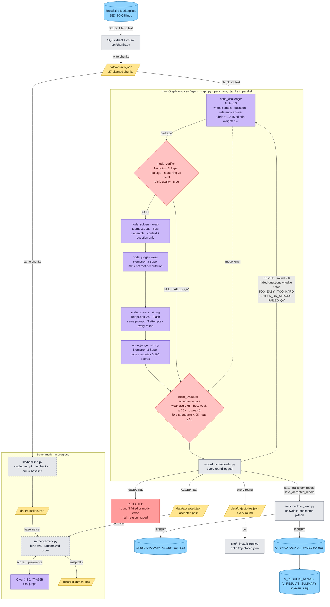

# OpenAutodata

**Fine-tuning data that has to earn its place.**

OpenAutodata is an open-source pipeline that turns raw documents into verified question-answer pairs for fine-tuning. Open-weight models work in a LangGraph loop: one writes a question and a grading rubric, one checks it for answer leakage, a small and a large model each try to answer it three times, and a judge grades every answer against the rubric. A question is kept only if the small model struggles and the large model solves it. Everything else is rewritten or thrown away.

We run it on real SEC 10-Q filings pulled from Snowflake and write the accepted dataset back to Snowflake.

> Built for **Best Open-Source AI Project** and the **Snowflake track** at Hack Day 2026.
> Open-weight models · small language model in the loop · open-source LangGraph harness · MIT licensed

---

## What we built

To fine-tune a model you need good question-answer pairs. Large labs pay human annotators to write and check them. Everyone else generates them with an LLM, and almost nobody checks the output: questions end up too easy (the model already knows the answer), unanswerable from the source, or paired with a wrong reference answer.

OpenAutodata implements the **Agentic Self-Instruct** loop from Meta FAIR's [AutoData](https://facebookresearch.github.io/RAM/blogs/autodata/) paper ([arXiv:2606.25996](https://arxiv.org/abs/2606.25996)). The idea: a good training example sits in the gap between what a weak model can do and what a strong model can do. Meta measured a weak/strong gap of **31.4 points** for data from this loop, versus **1.9 points** for single-shot CoT Self-Instruct (paper Table 1).

### The agents

| Step | Agent | What it does |
|---|---|---|
| 1 | **Challenger** | Reads one filing chunk and writes a **context** (only the facts the question needs, without the answer), a **question**, a **reference answer**, and a **rubric** of 10 to 15 criteria with integer weights 1 to 7. |
| 2 | **Quality verifier** | Before any solving: checks the context does not leak the answer, the question tests reasoning rather than recall, and every calculation criterion states its expected value. |
| 3 | **Weak solver** | Answers 3 times from the **context and question only**. It never sees the filing or the reference answer. |
| 4 | **Strong solver** | Same prompt, 3 times, **every round**. The paper skips it when the weak solver already failed the gate, to save compute; we keep it so every round has a weak/strong gap for the benchmark and the run log. |
| 5 | **Rubric judge** | Grades **each answer separately**, met or not met per criterion. It **never sees the reference answer**. Code turns the verdicts into a weighted 0 to 100 score. |
| 6 | **Evaluate** (code) | Applies the acceptance gate below and returns ACCEPTED, REVISE or REJECTED. |

The quality verifier and the rubric judge run on the same model (Nemotron 3 Super), with different prompts.

### The acceptance gate (paper Fig. 7)

| Check | Threshold | What it proves |
|---|---|---|
| Weak solver average | **≤ 65** | The question is not trivial |
| Best single weak attempt | **≤ 75** | The weak model is not just occasionally lucky |
| No weak attempt scores 0 | | A zero means too hard, with no learning signal |
| Strong solver average | **≥ 60 and < 95** | Answerable, but not so easy the strong model aces it |
| Gap (strong avg − weak avg) | **≥ 20** | There is real learning signal |
| Max rounds | **3** | Our budget cap; the paper has no fixed limit |

When a round fails, it is labelled `TOO_EASY`, `TOO_HARD`, `FAILED_ON_STRONG` or `FAILED_QV`. The Challenger then sees every earlier failed question with the judge's notes and must write an entirely new question from a different angle. After 3 failed rounds the chunk is discarded and the reason is logged.

### Data flow



_Dashed boxes are in progress. The original planning sketch is in [`Data_flow.png`](Data_flow.png)._

## Models

Every model is open-weight and served through [OpenRouter](https://openrouter.ai)'s OpenAI-compatible API. Model IDs live in [`src/config.py`](src/config.py) and can be overridden with `MODEL_<ROLE>` environment variables.

| Role | Model | OpenRouter ID | Size class | License |
|---|---|---|---|---|
| Challenger | [GLM-5.3](https://huggingface.co/zai-org/GLM-5.3) (Z.ai) | `z-ai/glm-5.3` | Large | [GLM-5.3 License](https://huggingface.co/zai-org/GLM-5.3/blob/main/LICENSE) |
| Weak solver | [Llama 3.2 3B Instruct](https://huggingface.co/meta-llama/Llama-3.2-3B-Instruct) (Meta) | `meta-llama/llama-3.2-3b-instruct` | **Small language model** (3B parameters, under the 10B line) | [Llama 3.2 Community License](https://www.llama.com/llama3_2/license/) |
| Strong solver | [DeepSeek V4.1 Flash](https://huggingface.co/deepseek-ai/DeepSeek-V4.1-Flash) (DeepSeek) | `deepseek/deepseek-v4.1-flash` | Large | [MIT](https://huggingface.co/deepseek-ai/DeepSeek-V4.1-Flash/blob/main/LICENSE) |
| Quality verifier and rubric judge | [Nemotron 3 Super 120B-A12B](https://huggingface.co/nvidia/NVIDIA-Nemotron-3-Super-120B-A12B-BF16) (NVIDIA) | `nvidia/nemotron-3-super-120b-a12b` | Large (120B total, 12B active) | [NVIDIA Nemotron Open Model License](https://www.nvidia.com/en-us/agreements/enterprise-software/nvidia-nemotron-open-model-license/) |
| Benchmark judge | [Qwen3.8 2.4T-A95B](https://huggingface.co/Qwen/Qwen3.8-2.4T-A95B) (Alibaba Qwen) | `qwen/qwen3.8-2.4t-a95b` | Large (2.4T total, 95B active) | [Qwen3.8-Max License](https://huggingface.co/Qwen/Qwen3.8-2.4T-A95B/blob/main/LICENSE) |

The weak solver is the only **small language model** (10B parameters or fewer). Every other role uses a **large language model**. The benchmark judge comes from a different model family than the loop judge, so the pipeline never grades its own output.

## Key packages

| Package | Used for |
|---|---|
| [LangGraph](https://github.com/langchain-ai/langgraph) | The agent state machine |
| [openai](https://github.com/openai/openai-python) | OpenAI-compatible client pointed at OpenRouter |
| [python-dotenv](https://github.com/theskumar/python-dotenv) | Loading `.env` |
| [snowflake-connector-python](https://github.com/snowflakedb/snowflake-connector-python) | Optional Snowflake ingest and writeback |
| [pytest](https://pytest.org) | Test suite |
| [Next.js](https://nextjs.org), [Motion](https://motion.dev), [Tailwind CSS](https://tailwindcss.com) | The project website and live run log in `site/` |

## How to run it

### 1. Install

Requires Python 3.10+.

```bash
git clone https://github.com/ritvikreddygangula/Open-AutoData.git
cd Open-AutoData
python -m venv .venv && source .venv/bin/activate   # Windows: .venv\Scripts\activate
pip install -r requirements.txt
```

### 2. Set up `.env`

```bash
cp .env.example .env
```

Then set your OpenRouter key in `.env` (get one at [openrouter.ai/keys](https://openrouter.ai/keys)):

```
OPEN_ROUTER=sk-or-...
```

That is the only required value. The Snowflake fields are optional. Leave `SNOWFLAKE_ENABLED=0` to run fully locally on JSON files.

### 3. Run

```bash
python -m src.agent_graph --limit 3      # try it on the first 3 chunks of data/chunks.json
python -m src.agent_graph                # run every chunk
pytest                                   # run the test suite (no API key needed)
```

`data/chunks.json` already holds 27 cleaned SEC 10-Q chunks. To use your own documents, convert any CSV with `CHUNK_ID` and `CHUNK_TEXT` columns first:

```bash
python -m src.chunks my_filings.csv      # → data/chunks.json
```

| Flag | Default | What it does |
|---|---|---|
| `--limit N` | all | Only the first N chunks |
| `--workers N` | 4 | Chunks processed in parallel. Lower it if OpenRouter rate-limits you |
| `--chunks PATH` | `data/chunks.json` | A chunks `.json` or `.csv` file |
| `--run-id ID` | `run-<UTC time>` | Tags every record from this run |
| `--out-dir DIR` | `data/` | Where the output files go |

Each chunk takes a few minutes of model calls. A crash or model outage in one chunk is logged and never stops the others. The run ends with a summary: each chunk's status, rounds used, and `N/M accepted`.

Output:
- `data/trajectories.json`: one record per round, with the context, question, rubric, all six attempt scores, failure mode and judge notes. Every run is appended and tagged with its `run_id`.
- `data/accepted.json`: the accepted pairs
- Snowflake tables `OPENAUTODATA_TRAJECTORIES` and `OPENAUTODATA_ACCEPTED_SET` when writeback is on (schema in [`sql/schema.sql`](sql/schema.sql)). A failed Snowflake insert is backed up to `data/snowflake_failed.jsonl` and never stops the loop.
- Snowflake views `V_RESULTS_ROWS` and `V_RESULTS_SUMMARY` ([`sql/results.sql`](sql/results.sql)) compare the latest loop run with the latest baseline run.

### 4. Watch it live (optional)

```bash
cd site && npm install && npm run dev   # http://localhost:3000
```

The website replays the latest run from `data/trajectories.json` and polls it while the pipeline runs. `npm run build` produces a static site in `site/out/` for Vercel or GitHub Pages.

## Benchmark

We compare OpenAutodata against single-shot generation on the same chunks: one prompt, one question, no checks. Both sets go through the same solvers and rubric judge, then Qwen3.8 judges them blind, with A/B order randomized.

| Metric | Single-shot baseline | OpenAutodata |
|---|---|---|
| Mean weak solver score | _pending run_ | _pending run_ |
| Mean strong solver score | _pending run_ | _pending run_ |
| Mean difficulty gap | _pending run_ | _pending run_ |
| Blind judge preference | _pending run_ | _pending run_ |

## Repository layout

```
data/chunks.json          cleaned SEC text chunks
data/trajectories.json    every round of every chunk
data/accepted.json        the accepted dataset
sql/schema.sql            Snowflake tables
sql/results.sql           Snowflake views comparing loop and baseline runs
src/config.py             model IDs, thresholds, paths
src/chunks.py             CSV → chunks.json loader
src/llm.py                OpenRouter client with retries and tolerant JSON parsing
src/state.py              agent state and the shared trajectory record
src/agent_graph.py        LangGraph loop, parallel chunk runner, command line
src/nodes.py              challenger, verifier, solvers, judge, evaluate
src/recorder.py           writes trajectories, accepted pairs and Snowflake rows
src/rubric.py             rubric validation and weighted scoring
src/gate.py               the paper's acceptance gate
src/default_prompts.py    agent prompts adapted from the paper
src/snowflake_sync.py     Snowflake ingest and writeback
site/                     project website and live run log
tests/                    pytest suite
```

## Limitations

- Difficulty is not the same as correctness. The strong-solver check and the quality verifier reduce bad reference answers but do not eliminate them.
- We measure dataset quality directly. We have not yet shown a downstream fine-tuning gain; that is the next experiment.
- Demonstrated on SEC filings. The pipeline works on any text, but thresholds may need tuning for other domains.
- The paper reports about 6.6 rounds per accepted question. With a 3-round cap, expect a low acceptance rate.

## Credits

- Method and acceptance thresholds from Meta FAIR's AutoData / Agentic Self-Instruct: Kulikov, Whitehouse, Wu, Nie, Saha, Helenowski, Yuan, Golovneva, Lanchantin, Bachrach, Foerster, Li, Fang, Sukhbaatar, Weston. [Blog](https://facebookresearch.github.io/RAM/blogs/autodata/) · [arXiv:2606.25996](https://arxiv.org/abs/2606.25996). Meta's version uses Kimi-K2.6 as orchestrator and judge and Qwen3.5 4B / 397B as solvers; we use a different set of open-weight models.
- SEC filing data via Snowflake Marketplace.
- Model logos in `site/public/logos` from [LobeHub Icons](https://github.com/lobehub/lobe-icons) (MIT).

## Team

- Karthik Reddy Yalala
- Ritvik Reddy Gangula
- Arun Teja Reddy Kallam
- Chinmay Vasisht Naganand

## License

MIT, see [LICENSE](LICENSE). Each model is used under its own license, linked in the [Models](#models) table.
